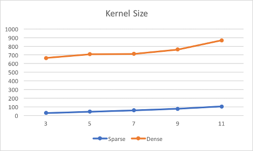
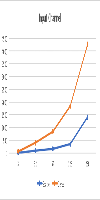
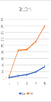
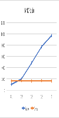
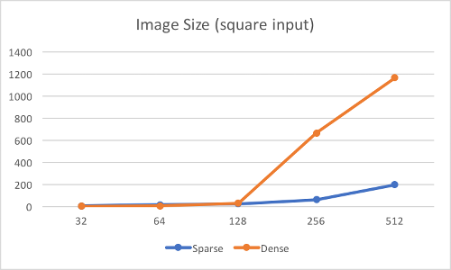

# Convolution-with-sparse-kernel-in-TF

TensorFlow implementation of convolution with sparse kernel. This operator is initially for deep learning pruning based on Song Han's [work](https://arxiv.org/pdf/1506.02626.pdf). For now, this operator only supports TensorFLow with CUDA support.

## Usage: 
1. cmake .
2. make 
3. To import the TF customized op, do
```python
_conv_sparse = tf.load_op_library('path_to_source_file/libconv_sparse.so')
conv_op = _conv_sparse.custom_convolution
```

## Results:











## TODO:
 - [ ] Use shared memory for CUDA multithreading
 - [ ] Improve result precision
 - [ ] Add CPU support
 - [ ] Separate the computation of dense-to-sprase within this operation to speed up more

**Still in progress...**
