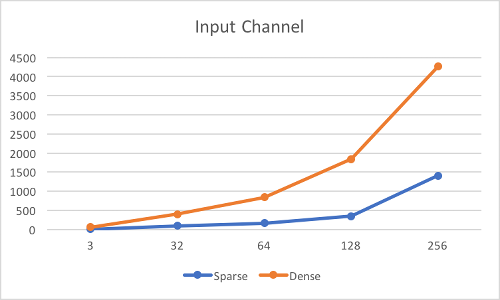
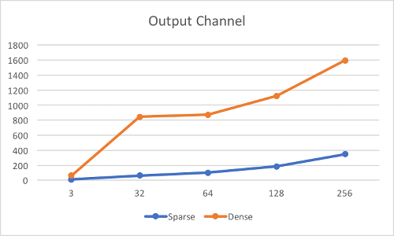

# Convolution-with-sparse-kernel-in-TF

**Still in progress...**

TensorFlow implementation of convolution with sparse kernel. This operator is initially for deep learning pruning based on Song Han's [work](https://arxiv.org/pdf/1506.02626.pdf). For now, this operator only supports TensorFlow with CUDA support.

## Usage: 
1. cmake .
2. make 
3. To import the TF customized op, do
```python
_conv_sparse = tf.load_op_library('path_to_source_file/libconv_sparse.so')
conv_op = _conv_sparse.custom_convolution
```

## Results:
Following figures show the current performance with respect to different hyperparameters, including kernel size, input channel, output channel, ratio of NNZ (number of nonzero) and the size of input. The unit along the vertical axis is in ms and these results is from NVIDIA GeForce 940M. 

**Input: 1 * 256 * 512 * 3; Kernel: ? * ? * 3 * 64; Ratio of NNZ: 0.1**


**Input: 1 * 256 * 512 * ?; Kernel: 11 * 11 * ? * 3; Ratio of NNZ: 0.1**



**Input: 1 * 256 * 512 * 3; Kernel: 11 * 11 * 3 * ?; Ratio of NNZ: 0.1**



**Input: 1 * 256 * 512 * 32; Kernel: 11 * 11 * 32 * 64; Ratio of NNZ: ?**


**Input: 1 * ? * ? * 3; Kernel: 11 * 11 * 3 * 64; Ratio of NNZ: 0.1**


## Discussion:
This sparse convolution is much faster than the buildin dense convolution in TF in most of case, besides with larger ratio of NNZ (not sparse anymore) or the smaller size of input. Since the acceleration becomes more prominent when the size of input is larger (especially along height and width channels), the overall performance of a small input could be mediocre for now, but I will continue improving the proformance.   

## TODO:
 - [ ] Use shared memory for CUDA multithreading
 - [ ] Improve result precision (the precision for now is about 1e-3)
 - [ ] Add CPU support
 - [ ] Separate the computation of dense-to-sprase within this operation to speed up more (since we only need to convert once during inference)
 - [ ] Debug when stride is over 2

## Reference:
This work also refers to the work of [GPU convolution](https://github.com/fjmh89/convolution). 
